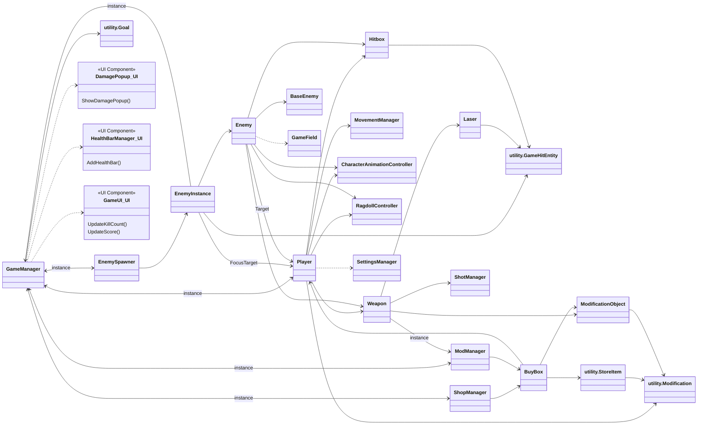

# Codebase Dependency Tree

This diagram illustrates the primary dependencies and relationships between the major classes in the Roguelike MVP codebase.

- `-->`: Represents a one-way reference, composition, or method call.
- `<-->`: Represents a two-way (cyclical) dependency, often due to the singleton pattern.
- `--|>`: Represents inheritance (e.g., `Enemy` inherits from `BaseEnemy`).

### Explanatory Notes

- **UI Components (Dotted Lines):** Classes like `DamagePopup`, `HealthBarManager`, and `GameUI` are referenced by `GameManager` but are not part of the core script files provided. They are included to show the connection between the game logic and the user interface.
- **`utility` Namespace:** Classes within the `utility` namespace are foundational data structures used by many other classes but generally do not have dependencies of their own.
- **`GameField`:** This singleton provides level boundary information to any class that needs it, such as `Enemy` for movement constraints.
- **Singletons & Cycles:** `GameManager`, `ShopManager`, `ModManager`, `ShotManager`, and `GameField` are all singletons. The extensive use of the singleton pattern (`.instance`) creates cyclical dependencies, as many classes call back into the managers that control them. These are marked with a `<-->` arrow. For example, `GameManager` holds a reference to `Player`, while `Player` can call `GameManager.instance` at any time.